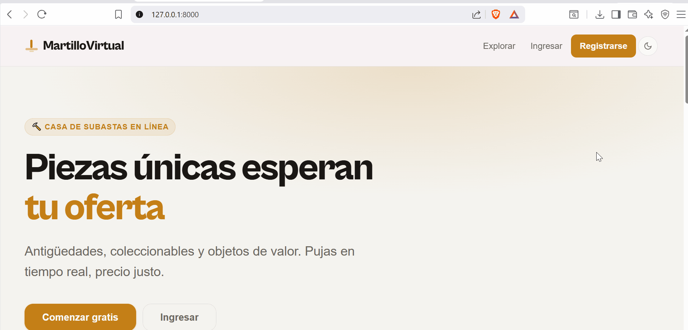
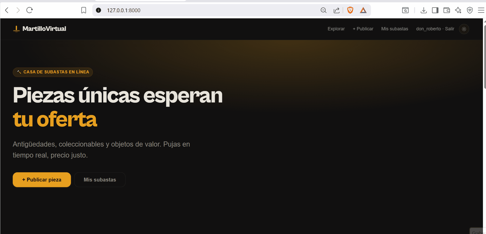
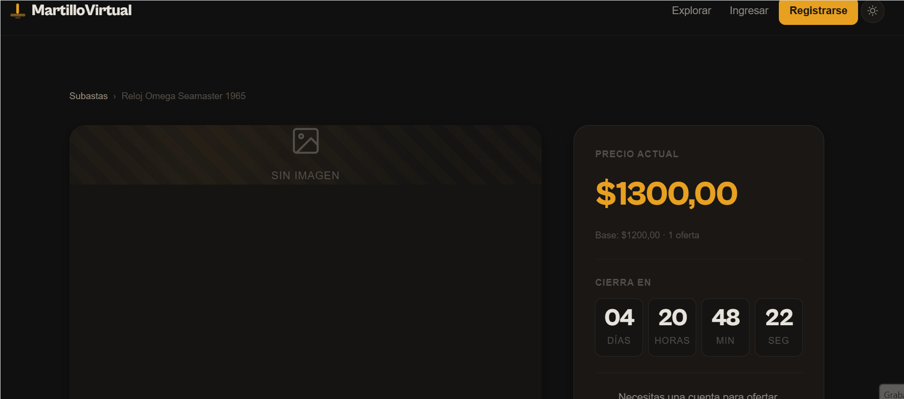
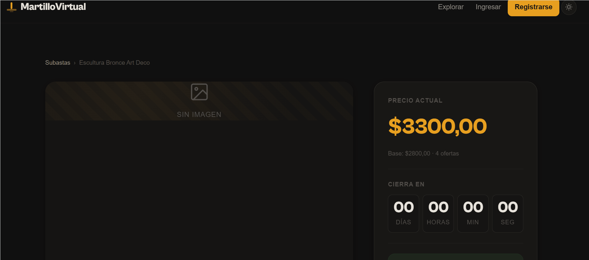
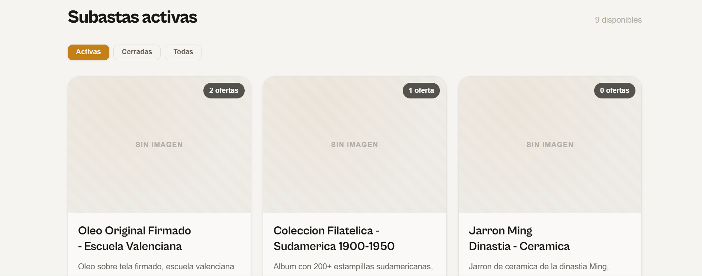
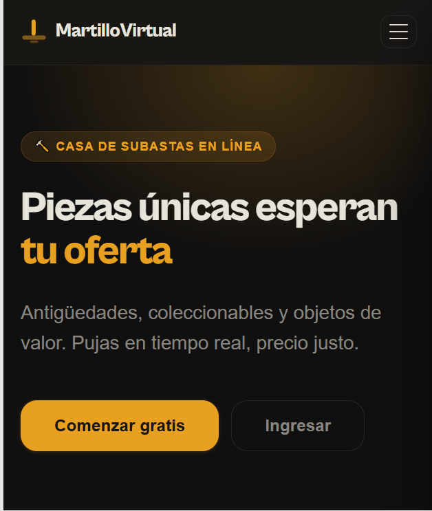

# MartilloVirtual

Casa de subastas online construida con **Django 6.0**. Proyecto de portafolio que demuestra arquitectura profesional: CRUD con CBVs, separacion de entornos, tests automatizados, protocolo de ganador con notificaciones email, y deploy-ready en Render + Supabase.

## Demo

| Homepage (Light/Dark Mode) | Dashboard (Mis Subastas) |
| :---: | :---: |
|  |  |

| Subasta Activa (Countdown) | Subasta Cerrada (Ganador) |
| :---: | :---: |
|  |  |

| Filtro por Estado | Menú Móvil (Dark Mode) |
| :---: | :---: |
|  |  |

## Stack

| Capa | Tecnologia |
|------|-----------|
| Backend | Django 6.0.3, Python 3.14 |
| Base de datos | SQLite (dev) / PostgreSQL Supabase (prod) |
| Frontend | HTML5 + CSS custom (design system OKLCH, dark mode, responsive mobile-first) |
| Deploy | Render (Procfile) + Supabase + WhiteNoise + Gunicorn |
| Seguridad | HSTS, Secure Cookies, CSRF, rate limiting (django-ratelimit), open redirect protection |
| Testing | pytest-django (125 tests, 97% coverage) |

## Features

### Backend
- CRUD completo de Subastas y Ofertas con Class-Based Views
- Autenticacion nativa Django (registro, login, logout)
- Autorizacion por rol -- solo el vendedor edita/elimina (`UserPassesTestMixin`)
- Validacion de ofertas en servidor (superar precio actual)
- Protocolo de ganador: `cerrar_subastas` command setea ganador al cerrar
- Notificaciones email al ganador via Django signals (`post_save`)
- Rate limiting en login (5/min) y registro (3/hora) via django-ratelimit
- Open redirect protection con `url_has_allowed_host_and_scheme`
- Race condition prevention con `transaction.atomic` + `select_for_update`
- Management commands: `seed_data`, `cerrar_subastas`, `backfill_ganadores`

### Frontend
- Diseno responsive mobile-first con dark mode (persiste via localStorage)
- Design system OKLCH con CSS custom properties
- Countdown en tiempo real (JavaScript vanilla)
- Filtros en homepage (?estado=activas|cerradas|todas) con tabs
- Dashboard "Mis Subastas" con stats y "Mis ofertas recientes"
- Badge "En vivo" condicional (verifica `esta_activa`)
- Placeholder de imagen con pattern + SVG icons
- Paginacion preserva filtros

### DevOps
- Settings multi-entorno: base / development / production
- Variables de entorno con python-dotenv
- Paginacion en la grilla (9 subastas por pagina)
- Paginas de error 404 y 500 personalizadas
- 125 tests automatizados con pytest-django
- Coverage 97% (views 99%, models 100%)
- Dockerfile (ejercicio de aprendizaje, no para deploy)
- render.yaml (Blueprint IaC con web + cron services)
- Procfile + runtime.txt para Render

## Instalacion local

```bash
# Requisito: Python 3.14+ (Django 6.0 no soporta 3.10/3.11)
python --version   # debe ser 3.14+

# 1. Clonar
git clone https://github.com/tu-usuario/martillo_virtual.git
cd martillo_virtual

# 2. Entorno virtual
python -m venv venv
source venv/bin/activate        # Windows: venv\Scripts\activate

# 3. Dependencias
pip install -r requirements.txt

# 4. Variables de entorno
cp .env.example .env
# Editar .env y generar SECRET_KEY:
python -c "from django.core.management.utils import get_random_secret_key; print(get_random_secret_key())"

# 5. Base de datos y datos demo
python manage.py migrate
python manage.py seed_data
python manage.py backfill_ganadores  # setea ganadores en cerradas con ofertas

# 6. Superusuario (opcional, para admin)
python manage.py createsuperuser

# 7. Servidor
python manage.py runserver
```

Abre http://127.0.0.1:8000

## Testing

```bash
# Correr todos los tests
python -m pytest

# Con coverage report
python -m pytest --cov=subastas --cov-report=term-missing

# Tests especificos
python -m pytest subastas/tests/test_models.py -v
python -m pytest subastas/tests/test_views.py -v
python -m pytest subastas/tests/test_signals.py -v
```

**Resultado:** 125 tests, 97% coverage total (views 99%, models 100%).

## Deploy

Ver [DEPLOY.md](DEPLOY.md) para guia completa paso a paso (personal + repo).

Resumen:
1. Crear proyecto Supabase, obtener `DATABASE_URL`
2. Push a GitHub
3. Conectar Render via Blueprint (lee `render.yaml`)
4. Setear `DATABASE_URL` en env vars
5. Deploy automatico (buildCommand corre migrate + collectstatic)
6. Post-deploy: `seed_data --reset` + `backfill_ganadores` via Shell

## Estructura del proyecto

```
martillo_virtual/
├── config/
│   ├── settings/
│   │   ├── __init__.py       # Carga dev o prod segun DJANGO_ENV
│   │   ├── base.py           # Comun: apps, middleware, auth, static
│   │   ├── development.py    # SQLite, DEBUG=True, EMAIL_BACKEND=console
│   │   └── production.py     # Supabase, DEBUG=False, security headers, SMTP
│   ├── urls.py
│   ├── wsgi.py
│   └── asgi.py
├── subastas/
│   ├── management/commands/
│   │   ├── seed_data.py      # 15 subastas demo + 5 usuarios + ofertas
│   │   ├── cerrar_subastas.py # Cierra expiradas, setea ganador
│   │   └── backfill_ganadores.py # Backfill ganador en cerradas sin ganador
│   ├── migrations/           # 0001-0005 (initial, options, indexes, remove fecha_inicio, ganador FK)
│   ├── templates/subastas/   # inicio, detalle, form, delete, dashboard, auth, errors
│   ├── tests/                # test_models, test_views, test_forms, test_signals, test_management, test_ratelimit, test_backfill
│   ├── models.py             # Subasta + Oferta + ganador FK + properties
│   ├── views.py              # CBVs + FBVs + filters + annotations
│   ├── forms.py              # SubastaForm + OfertaForm + RegistroForm + LoginForm
│   ├── signals.py            # post_save: email al ganador
│   ├── admin.py              # ModelAdmin + OfertaInline
│   └── urls.py               # Namespaced URLs
├── templates/
│   └── base.html             # Layout + navbar + dark mode toggle (localStorage)
├── static/css/style.css      # Design system OKLCH, dark mode, responsive
├── .env.example
├── .gitignore
├── Dockerfile                # Learning exercise (no usado en Render)
├── .dockerignore
├── Procfile                  # Render deploy: gunicorn config.wsgi
├── render.yaml               # Blueprint IaC (web + cron services)
├── runtime.txt               # python-3.14.5
├── .python-version           # 3.14.5 (pyenv/asdf)
├── requirements.txt          # Django 6.0.3 + deps + testing
├── pytest.ini                # pytest-django config
├── conftest.py               # Fixtures (vendedor, ofertante, subasta_activa, etc.)
├── DEPLOY.md                 # Guia deploy dual (personal + repo)
├── README.md                 # Este archivo
└── manage.py
```

## Usuarios demo

Despues de `python manage.py seed_data`:

| Username | Password | Rol |
|----------|----------|-----|
| don_roberto | Demo1234! | Vendedor + ofertante |
| maria_coleccionista | Demo1234! | Vendedora + ofertante |
| pedro_antiguo | Demo1234! | Ofertante |
| elena_arte | Demo1234! | Vendedora + ofertante |
| lucas_nuevo | Demo1234! | Ofertante |

## Datos demo

- 15 subastas (9 activas, 4 cerradas con ofertas, 2 canceladas)
- 5 usuarios demo
- ~14 ofertas con competencia en subastas cerradas
- Ganadores backfilled en cerradas con ofertas

## Lo que NO esta incluido (future enhancements)

- **Payment gateway:** no integrado (decision de scope, ver POSTMORTEM.md)
- **Real-time notifications:** solo email, no WebSocket/Channels
- **Image upload con storage cloud:** imagenes locales, no S3/Cloudinary
- **CSP nativo Django 6.0:** no configurado (JS inline requiere nonces)
- **Template partials:** no usados (navbar simple sin partialdef)
- **Background tasks framework:** no configurado (email sincrono)
- **Admin customization:** default Django admin con config funcional

## Licencia

Proyecto de portafolio. Uso educativo.

---

Desarrollado como proyecto de portafolio -- Django 6.0 Profesional.
